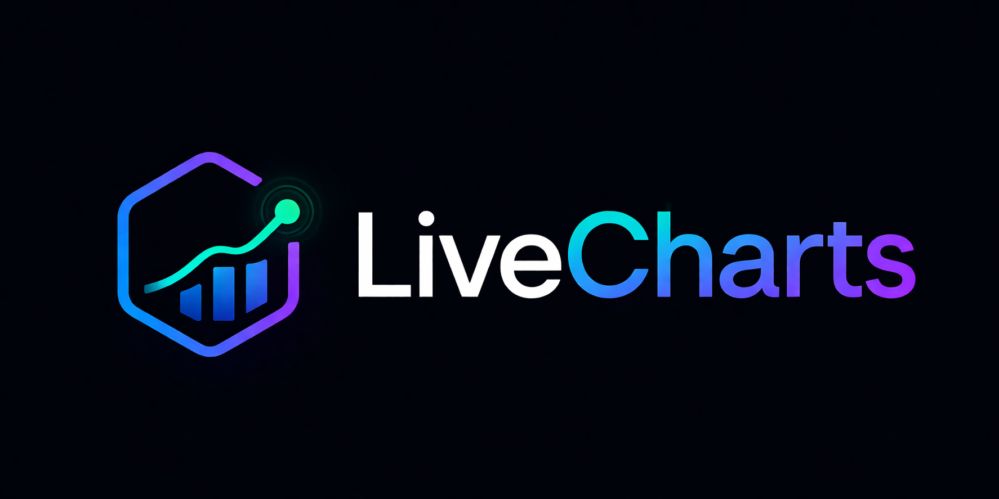

<p align="center">
    
</p>

<p align="center">
    <a href="https://packagist.org/packages/matheusmarnt/livecharts"></a>
    <a href="https://github.com/matheusmarnt/livecharts/actions?query=workflow%3Atests+branch%3Amain"></a>
    <a href="https://github.com/matheusmarnt/livecharts/actions?query=workflow%3A%22Fix+PHP+code+style+issues%22+branch%3Amain"></a>
    <a href="https://packagist.org/packages/matheusmarnt/livecharts"></a>
    <a href="LICENSE.md"></a>
    <a href="https://laravel.com"></a>
    <a href="https://livewire.laravel.com"></a>
</p>

# LiveCharts

Reactive chart abstraction for Laravel — pure PHP API, multi-engine rendering, Livewire delivery.

LiveCharts unifies ApexCharts and Chart.js behind a single fluent PHP API. Define charts in PHP, render them with one Livewire component, and update them reactively from your application state — no JavaScript boilerplate, no engine-specific configuration leaking into your views.

## Features

- **Fluent + class-based builders** — `LiveCharts::line()->labels(...)->dataset(...)` or `class extends Chart`
- **18 chart types** — line, bar, area, pie, donut, radar, scatter, bubble, heatmap, range bar, radial bar, polar area, box plot, treemap, candlestick, matrix, sankey, plus a generic factory
- **Multi-engine** — ApexCharts and Chart.js out of the box, with `LiveCharts::registerEngine()` for custom adapters
- **Livewire-native rendering** — single `<livewire:livecharts :chart="$chart" />` component handles mount, hydration, and re-render
- **Reactive updates** — bind chart data to Livewire properties; the component re-renders when state changes
- **Polling** — `Chart::poll(5000)` + `wire:poll="refresh"` integration with a `livecharts:refreshed` event for userland data hydration
- **Interaction events** — `onDataPointClick`, `onZoom`, `onSelection`, `onScroll` map directly to Livewire events
- **Broadcasting** — push chart updates over Laravel Echo channels with `broadcastOn()` / `broadcastAs()`
- **Theme-aware color tokens** — 289-case `TwColor` enum (all Tailwind v4 families + 4 extensions × 11 shades) with `dark:`/`light:` named-arg API: `->titleColor(dark: TwColor::Amber300, light: TwColor::Amber600)`. Charts re-color live on dark-mode toggle — no Livewire roundtrip
- **Palette presets** — `->palette(TwPalette::Vibrant)` auto-fills dataset colors from theme-aware preset schemes
- **Typography** — `->titleFont(size: 18, weight: 'bold', family: 'Inter')` for title, legend, and tooltip
- **Theme detection** — `auto`, `light`, or `dark` modes; JS observer watches `<html class="dark">` (or `prefers-color-scheme`) and re-colors charts live
- **Local-first assets with CDN fallback** — engine bundles (`apexcharts.js`, `chartjs.js`) and Chart.js plugin bundles (treemap/matrix/sankey/financial/luxon/adapter-luxon) ship pre-built in `resources/dist`; switch between `local`, `cdn`, or `both` via config
- **Vite build pipeline** — lib-mode IIFE outputs for `livecharts.js` + every engine and plugin shim, verified in CI
- **Stub publishing** — `livecharts:install` can publish chart class stubs to `stubs/livecharts` for project-level customization
- **Browser preview** — `php artisan livecharts:preview` launches a gallery of every chart type in your default browser
- **i18n** — ships with `en`, `pt_BR`, and `es` translations
- **Type-safe** — PHPStan level 8, PHP 8.2+, strict types throughout

## Quick Start

```bash
composer require matheusmarnt/livecharts
php artisan livecharts:install
```

This will:
1. Publish `config/livecharts.php`
2. Copy the LiveCharts JS runtime + engine bundles to `public/vendor/livecharts/js` (local-first delivery with CDN fallback by default — `LIVECHARTS_ASSETS_MODE=both`)
3. Optionally publish chart class stubs to `stubs/livecharts`

> **Note:** The default asset mode is `both` (local first, CDN fallback). The files in `public/vendor/livecharts/js/` must exist for this to work. If you skip the install step or need to restore the assets after deployment, run:
> ```bash
> php artisan vendor:publish --tag=livecharts-assets --force
> ```
> If you prefer no local files at all, set `LIVECHARTS_ASSETS_MODE=cdn` in `.env` — no publish step needed.

Then build a chart and render it:

```php
use Matheusmarnt\LiveCharts\Facades\LiveCharts;

$chart = LiveCharts::line()
    ->title('Monthly Revenue')
    ->labels(['Jan', 'Feb', 'Mar'])
    ->dataset('2026', [100, 200, 150])
    ->colors(['#3B82F6']);
```

```blade
<livewire:livecharts :chart="$chart" />
```

Place the asset directive once in your layout, **before `@livewireScripts`** and before the closing `</body>` tag (or in the `<head>` when using a Blade layout with `@extends`/`@section`):

```blade
{{-- must come BEFORE @livewireScripts — livecharts.js registers Alpine components before Alpine starts --}}
@liveChartsScripts
@livewireScripts
```

## Building Charts

### Fluent builder

Every method returns `$this`, so chains read top-down:

```php
LiveCharts::bar()
    ->title('Sales by Region')
    ->subtitle('Q1 2026')
    ->labels(['North', 'South', 'East', 'West'])
    ->dataset('Sales', [400, 300, 600, 250])
    ->colors(['#10B981'])
    ->stacked()
    ->height(420)
    ->theme('auto');
```

Available factories: `line`, `bar`, `area`, `pie`, `donut`, `radar`, `scatter`, `bubble`, `heatmap`, `rangeBar`, `radialBar`, `polarArea`, `boxPlot`, `treemap`, `candlestick`, `matrix`, `sankey`, plus `make()` for the generic factory.

### Class-based charts

Generate a dedicated class for reusable charts:

```bash
php artisan make:chart RevenueChart --type=bar
```

```php
namespace App\Charts;

use Matheusmarnt\LiveCharts\Charts\Chart;
use Matheusmarnt\LiveCharts\Charts\Dataset;

class RevenueChart extends Chart
{
    protected string $type = 'bar';

    public function __construct()
    {
        parent::__construct();

        $this
            ->title('Revenue')
            ->labels(['Jan', 'Feb', 'Mar'])
            ->datasets([
                Dataset::make('2026')->data([400, 300, 600])->color('#10B981'),
            ]);
    }
}
```

```blade
<livewire:livecharts :chart="new App\Charts\RevenueChart" />
```

> **Stubs:** running `livecharts:install` and accepting the stubs prompt publishes the generator stub to `stubs/livecharts/chart.stub`. Edit that file to customize the boilerplate emitted by `make:chart`.

## Reactive Charts

### Polling

```php
$chart->poll(5000); // refresh every 5 seconds
```

The Livewire component subscribes via `wire:poll="refresh"` and dispatches a browser event on every tick:

```js
window.addEventListener('livecharts:refreshed', (e) => {
    // e.detail.id — chart DOM id
})
```

Hydrate fresh data inside `refresh()` on a parent Livewire component, or react to the event on the client.

### Click and zoom events

```php
$chart
    ->onDataPointClick('chart-clicked')
    ->onZoom('chart-zoomed')
    ->onSelection('chart-selected');
```

In the parent component:

```php
use Livewire\Attributes\On;

#[On('chart-clicked')]
public function handle(array $data): void
{
    // $data: ['seriesIndex' => 0, 'dataPointIndex' => 2, 'value' => 150, 'label' => 'Mar']
}
```

### Broadcasting

```php
$chart->broadcastOn('private-charts.'.$user->id)->broadcastAs('chart.updated');
```

Subscribe via Laravel Echo and the chart re-renders when the channel fires.

## Multi-Engine

The default engine is `apexcharts`. Override globally in `config/livecharts.php` or per chart:

```php
LiveCharts::line()->engine('chartjs')->labels(...)->dataset(...);
```

Register a custom adapter at runtime:

```php
use App\LiveCharts\Engines\HighchartsAdapter;
use Matheusmarnt\LiveCharts\Facades\LiveCharts;

LiveCharts::registerEngine('highcharts', HighchartsAdapter::class);
```

Implement `Matheusmarnt\LiveCharts\Contracts\EngineAdapter` and the engine becomes selectable from any chart.

## Commands

| Command | Description |
|---|---|
| `livecharts:install` | Publish config, copy the JS runtime + engine bundles, optionally publish chart stubs |
| `make:chart {name} {--type=} {--engine=}` | Generate a new chart class under `app/Charts`; `--type`/`--engine` derived from `Chart::TYPES` and `EngineFactory::names()` |
| `livecharts:preview {--no-open}` | Open the gallery of every chart type at `/livecharts/preview` in your default browser; `--no-open` only prints the URL |

## Documentation

- [Installation guide](docs/installation.md) — step-by-step setup, asset modes, engine selection, customization

## Testing

```bash
composer test
```

Runs the Pest suite (288 tests) against the package's testbench harness — including 17 Pest arch rules, payload + adapter routing for every chart type, Livewire color-roundtrip tests (Bugs 1 & 5), ApexCharts themed-color path tests, script-stack idempotency tests, and integration tests for UC-01 dashboard, UC-02 drill-down, UC-03 polling, and UC-04 multi-tenant flows. CI matrix: PHP 8.2-8.5 × Laravel 11/12/13 × Livewire 3/4 × prefer-lowest/stable × Ubuntu/Windows, with a `--min=90` coverage gate and PHPStan level 8 enforcement.

## Changelog

See [CHANGELOG](CHANGELOG.md) for release history.

## Contributing

See [CONTRIBUTING](CONTRIBUTING.md) for details.

## Security

If you discover a security vulnerability, please email matheusmarnt@gmail.com instead of opening a public issue.

## Credits

- [Matheus Mariano](https://github.com/matheusmarnt)
- [All Contributors](../../contributors)

## License

MIT — see [LICENSE](LICENSE.md).
